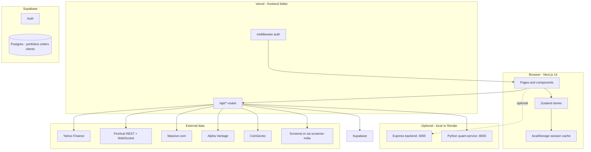
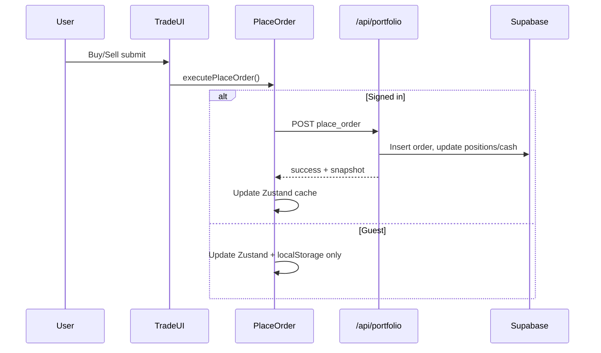
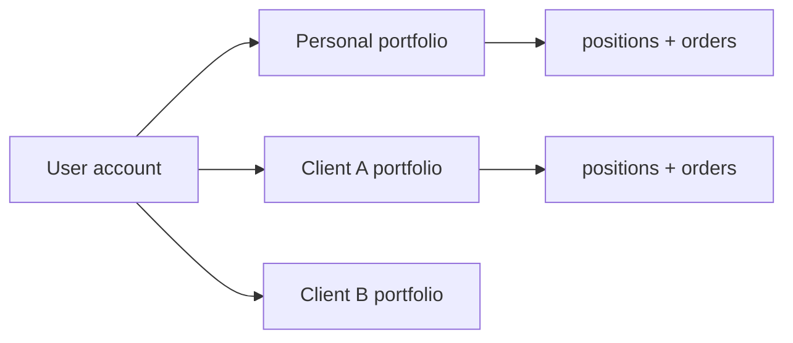

# QuantDesk — Complete Platform Guide

This document explains **how the entire QuantDesk website works**: every major page, feature, data flow, and business rule. Use it for onboarding, demos, investor decks, or handoff to developers.

**Paper trading only.** Virtual capital. Not a real brokerage. Not financial advice.

---

## Table of contents

1. [What QuantDesk is](#1-what-quantdesk-is)
2. [System architecture](#2-system-architecture)
3. [Authentication and access](#3-authentication-and-access)
4. [Navigation map](#4-navigation-map)
5. [Page-by-page features](#5-page-by-page-features)
6. [Market data logic](#6-market-data-logic)
7. [Trading and portfolio logic](#7-trading-and-portfolio-logic)
8. [Wealth desk and multi-book](#8-wealth-desk-and-multi-book)
9. [Quant Lab and Python engine](#9-quant-lab-and-python-engine)
10. [API reference (where code runs)](#10-api-reference-where-code-runs)
11. [Real-time and live prices](#11-real-time-and-live-prices)
12. [Environment variables](#12-environment-variables)
13. [Deployment topology](#13-deployment-topology)
14. [Related docs](#14-related-docs)

---

## 1. What QuantDesk is

QuantDesk is a **full-stack paper trading platform** that simulates a professional trading desk:

| Capability | Description |
|------------|-------------|
| **Live market data** | Stocks, crypto, indices, forex, movers — from multiple providers with fallbacks |
| **Order execution** | Market and limit orders against virtual cash |
| **Portfolio** | Holdings, P&L, trade history, per-symbol detail and exit flow |
| **Options & quant** | Black–Scholes, Greeks, Monte Carlo, backtests, ML-style predictions |
| **Wealth / broker mode** | Personal book + client books for advisor-style workflows |
| **India fundamentals** | Screener.in data via `screener-india` on the Markets page |

Default starting capital: **$100,000** (USD paper wallet), stored per user in **Supabase** when signed in, or in **browser localStorage** as guest.

---

## 2. System architecture



**Source of truth for trades (signed-in user):** Supabase tables (`portfolios`, `positions`, `orders`, `clients`, etc.).

**Guest mode:** Zustand + `localStorage` only; no cloud persistence until login.

**Quant models:** Python FastAPI service (`quant-service/`), reached through Next.js proxy `/api/quant/*`.

---

## 3. Authentication and access

### Sign up / sign in

| Route | Purpose |
|-------|---------|
| `/login` | Email/password or OAuth via Supabase |
| `/signup` | New account |
| `/auth/callback` | OAuth redirect handler |
| `/welcome/terms`, `/welcome/about` | Legal onboarding after first login |

### Middleware (`frontend/middleware.ts`)

When Supabase env vars are set:

1. **Protected routes** require a logged-in session: `/markets`, `/trade`, `/portfolio`, `/wealth`, `/desk`, `/quant-lab`, etc.
2. **Auth routes** redirect logged-in users away from `/login` and `/signup`.
3. **Onboarding** can force new users through welcome/terms before full app access.

Without Supabase config, the app runs in **guest mode** (no server auth).

### Cloud sync (`CloudSyncProvider`)

After login:

1. Loads the user’s **personal portfolio book** from `/api/wealth/books`.
2. Hydrates **Zustand** from `/api/portfolio` (positions, cash, orders).
3. Re-syncs when auth state or active book changes.

---

## 4. Navigation map

Sidebar (main app shell):

| Menu label | URL | Primary purpose |
|------------|-----|-----------------|
| Dashboard | `/` | Home: ticker, KPIs, market watch, app map |
| Markets | `/markets` | World stocks, crypto, US movers; India fundamentals |
| Trade | `/trade` | Place orders, chart, symbol search |
| Portfolio | `/portfolio` | Holdings, overview, exit positions |
| Broker & Clients | `/desk` | Client list, broker tools, profile |
| Wealth Desk | `/wealth` | Personal vs client book switcher |
| Algo Desk | `/algo-trading` | Simulated algo engine + optional portfolio sync |
| Forex & Options | `/forex-options` | Forex pairs + options panels |
| Quant Lab | `/quant-lab` | ML, options pricer, Monte Carlo, backtest |
| Research | `/research` | Regional research / backtest UI |

Other routes: `/options`, `/forex`, `/orders`, `/wallet`, `/messages`, `/profile`, `/privacy`.

---

## 5. Page-by-page features

### 5.1 Dashboard (`/`)

| Feature | How it works |
|---------|----------------|
| **Ticker tape** | Scrolling symbols with live/delayed quotes |
| **KPI strip** | Paper capital, universe size, refresh cadence, risk tools (static labels) |
| **New user suggestions** | API `/api/suggestions/stocks` — starter ideas sized to wallet cash |
| **Live market watch** | Component polls quotes for a watchlist |
| **Global indices** | `/api/market/indices` |
| **Application map** | Quick links grouped Trading / Analytics / Advisory |

**Logic:** Client-side page; data from Next.js API routes. Animations via Framer Motion (respects reduced motion).

---

### 5.2 Markets (`/markets`)

Three tabs:

| Tab | Data source | Logic |
|-----|-------------|--------|
| **World Markets** | `/api/market/quotes?region=` | Region picker: US, India, UK, Europe, Asia, Indices — symbols from `lib/markets/world-markets.ts` |
| **Cryptocurrency** | `/api/market/crypto` | CoinGecko top coins |
| **US Top Movers** | `/api/market/movers` | Gainers, losers, most active (US) |

**India region (special):**

- Calls **`GET /api/market/india`** instead of generic quotes.
- Merges **live prices** (quote provider chain) with **Screener.in fundamentals** via npm package **`screener-india`** (server-side).
- Extra columns: P/E, ROE, dividend yield, Screener market cap.
- **Details** opens slide-in panel → **`GET /api/market/india/[symbol]`** (full financials, pros/cons, tables).

Refresh: auto every **30 seconds** on active tab.

---

### 5.3 Trade (`/trade`)

| Feature | Logic |
|---------|--------|
| Symbol search | `/api/market/search` — equities, crypto, futures hints |
| Live chart | `/api/market/chart/[symbol]` — OHLCV candles |
| Order form | Market or limit; buy/sell |
| Execution | `executePlaceOrder` → `/api/portfolio` `place_order` when signed in, else local Zustand |
| Market hours | US calendar: **no new orders Saturday–Sunday** (`lib/trading/marketHours.ts`) |
| Live price | Finnhub WebSocket when configured; else polling |

---

### 5.4 Portfolio (`/portfolio`)

| Tab / area | Logic |
|------------|--------|
| **My Holdings** | Per-symbol cards: buy history, duplicate-buy warning, live indicator |
| **Overview** | Summary table, allocation, total P&L |
| **Exit position** | Real-time unrealized P&L preview → sell → realized P&L |
| **Market status banner** | Weekend = frozen UI, no trading |
| **Price updates** | Polling + optional WebSocket; weekend may pause polling |

**P&L math:** `lib/trading/exitPnl.ts` — unrealized/realized from avg cost and live price.

**Data load:** `loadPortfolioSnapshot()` — Supabase first, fallback local store.

---

### 5.5 Research (`/research`)

- Regional symbol context from world markets.
- Backtest and analytics UI tied to `/api/trading/backtest` and chart data.
- Educational metrics: Sharpe, drawdown, equity curve (see Research components).

---

### 5.6 Quant Lab (`/quant-lab`)

Full guide: [`QUANT_LAB.md`](./QUANT_LAB.md).

| Tab | Backend | Summary |
|-----|---------|---------|
| Market Overview | Finnhub proxy `/api/quant/finnhub/*` | Quote, profile, metrics, news sentiment |
| Predictions | Python `POST /predict-suite` | Algo signals + Ridge/RF/GB ML ensemble |
| Options | Python `POST /price`, chain APIs | Black–Scholes + Greeks |
| Monte Carlo | Python `POST /monte-carlo` | Simulated paths |
| Backtest | Python `POST /backtest` | SMA, RSI, buy-hold strategies |
| News & Sentiment | Finnhub `news-sentiment` | Buzz and sentiment scores |

**Proxy:** `app/api/quant/[...path]/route.ts` → `QUANT_SERVICE_URL`.

**Client store:** `useQuantLabStore` (Zustand) — symbol, tab, live quote, beginner/pro mode.

---

### 5.7 Algo Desk (`/algo-trading`)

- Simulated strategy engine (signals, logs, paper fills).
- Optional **sync to portfolio** — paper orders via same `executePlaceOrder` path.
- Live P&L strip for the algo symbol.

---

### 5.8 Forex & Options (`/forex-options`)

- Lazy-loaded **ForexPanel** and **OptionsPanel**.
- Forex: `/api/market/forex`.
- Options: chain from `/api/trading/options-chain/[symbol]`, pricing via Python or `/api/trading/price-option`.

---

### 5.9 Wealth Desk (`/wealth`) and Broker (`/desk`)

| Concept | Logic |
|---------|--------|
| **Personal book** | User’s own paper portfolio |
| **Client books** | Separate portfolio per client (advisor demo) |
| **Book switcher** | `useActiveBookStore` — all orders/portfolio API calls scoped by `portfolioId` / `clientId` |
| **Desk** | Client CRUD, seed demo clients, profile sections |
| **Wallet** | Cash view per book |

APIs: `/api/wealth/books`, `/api/wealth/clients`, `/api/wallet`, `/api/wealth/broker`.

---

### 5.10 Auth and legal pages

- `/privacy`, `/terms` — static legal copy.
- Config banner if Supabase or site URL misconfigured.

---

## 6. Market data logic

### Quote provider priority (stocks)

Implemented in `lib/market/fetchMarketQuotes.ts`:

```
1. Massive.com   (if MASSIVE_API_KEY)
2. Finnhub REST  (if FINNHUB_API_KEY) — official npm client on server
3. Yahoo Finance (yahoo-finance2)
4. Alpha Vantage (last resort, if ALPHAVANTAGE_API_KEY)
```

Per-symbol: first successful provider wins. Response includes which provider was used (`massive`, `finnhub`, `yahoo`, `mixed`, etc.).

### Symbol conventions

| Market | Example symbol | Notes |
|--------|----------------|-------|
| US | `AAPL` | |
| India NSE | `RELIANCE.NS` | Yahoo suffix |
| UK | `SHEL.L` | LSE |
| Europe | `SAP.DE` | XETRA |
| Crypto | `BTC-USD` | Trade and quotes |
| Index | `^GSPC` | |

### Caching

- API routes use in-memory cache (`lib/market-fetch.ts`) — typically **15–30s** for quotes, **2–5 min** for India/Screener bundles.

### India / Screener.in

- Package: **`screener-india`** (unofficial Screener.in client).
- Server only — `lib/market/screenerIndia.ts`.
- Rate-limited (~350ms between requests); batches `compareCompanies` for watchlist.

---

## 7. Trading and portfolio logic

### Order placement flow



### Order types

| Type | Behavior |
|------|----------|
| **Market** | Fills at current live price (or last known) |
| **Limit** | Stored logic depends on implementation in place order handler — check `lib/trading/placeOrder.ts` and server `placeOrderServer` |

### Weekend rules (US)

| Rule | Implementation |
|------|----------------|
| No new buy/sell Sat–Sun | `canPlaceMarketOrders()` false |
| UI frozen styling | Portfolio holdings, banners |
| User message | `getTradingBlockReason()` |

### Exit all

- `POST /api/portfolio/exit-all` — liquidate all positions in active book.

---

## 8. Wealth desk and multi-book



- Switching book in UI changes which `portfolio_id` is sent to APIs.
- Each book has isolated cash, positions, and order history.
- Demo seed: `/api/wealth/clients/seed`.

---

## 9. Quant Lab and Python engine

| Component | Role |
|-----------|------|
| `quant-service/` | FastAPI: Black–Scholes, IV, Monte Carlo, backtest, predict-suite |
| `QUANT_SERVICE_URL` | e.g. `http://localhost:8000` or Render `quantdesk-quant` |
| Finnhub proxy | Separate from Python — Next.js `/api/quant/finnhub/[endpoint]` |

**Health:** Quant Lab header shows ENGINE ONLINE/OFFLINE from `/api/quant/health`.

**Do not** point browser directly at Python — always through Next.js proxy (CORS, API keys).

---

## 10. API reference (where code runs)

### On Vercel (Next.js `frontend/app/api/`)

| Route group | Purpose |
|-------------|---------|
| `/api/market/*` | Quotes, chart, crypto, indices, movers, search, regions, forex, **india** |
| `/api/portfolio` | Get portfolio, place_order, sync_prices, exit-all |
| `/api/orders` | Order history helpers |
| `/api/wealth/*` | Books, clients, broker |
| `/api/wallet` | Wallet balances |
| `/api/quant/[...path]` | Proxy to Python quant service |
| `/api/quant/finnhub/[endpoint]` | Finnhub SDK proxy for Quant Lab |
| `/api/trading/*` | Options chain, backtest, volatility, signals |
| `/api/suggestions/stocks` | New user stock ideas |
| `/api/legal/*` | Onboarding acceptance |
| `/api/messages` | Messages feature |
| `/api/watchlist` | Watchlist CRUD |

### On Render `quantdesk-api` (optional Express `backend/`)

| Route | Purpose |
|-------|---------|
| `/api/health` | Health check |
| `/api/market/*` | Legacy/alternate market API |
| `/api/trading/*` | Trading endpoints |

**Note:** Wealth, portfolio, and auth APIs are **not** on Render Express — they live on **Vercel** only. See [`RENDER.md`](./RENDER.md).

### Python `quant-service` (Render or local)

| Method | Path | Purpose |
|--------|------|---------|
| GET | `/health` | Engine status |
| POST | `/price` | Option pricing + Greeks |
| POST | `/monte-carlo` | MC simulation |
| POST | `/backtest` | Strategy backtest |
| POST | `/predict-suite` | ML + algo predictions |

---

## 11. Real-time and live prices

| Mechanism | Used where | Config |
|-----------|----------|--------|
| **HTTP polling** | Markets, portfolio, trade | 10–30s intervals |
| **HTTP price polling** | Trade, portfolio, ticker | `/api/market/quotes` (no browser Finnhub key) |
| **Supabase realtime** | Optional messages / sync | Supabase project |

WebSocket manager deduplicates subscriptions and reconnects on failure.

---

## 12. Environment variables

### Frontend (`frontend/.env.local`)

| Variable | Required | Purpose |
|----------|----------|---------|
| `NEXT_PUBLIC_SUPABASE_URL` | For auth/cloud | Supabase project URL |
| `NEXT_PUBLIC_SUPABASE_ANON_KEY` | For auth/cloud | Supabase anon key |
| `NEXT_PUBLIC_SITE_URL` | Production | OAuth redirects |
| `QUANT_SERVICE_URL` | Quant Lab | Python engine URL |
| `FINNHUB_API_KEY` | Recommended | REST quotes + server Finnhub SDK (never expose via `NEXT_PUBLIC_`) |
| `MASSIVE_API_KEY` | Optional | Primary quote provider |
| `ALPHAVANTAGE_API_KEY` | Optional | Quote fallback |
| `SCREENER_IN_SESSION` | Optional | Screener.in private screens |

Copy from `frontend/.env.example`.

### Backend (local `backend/.env`)

`PORT`, `CORS_ORIGINS`, optional `NEWS_API_KEY`.

### Render

See [`RENDER.md`](./RENDER.md) — use `NPM_CONFIG_PRODUCTION=false npm ci && npm run build` for Express TypeScript builds.

---

## 13. Deployment topology

| Service | Host | URL pattern |
|---------|------|-------------|
| **Web app** | Vercel | `https://algo-street.vercel.app` (root = `frontend/`) |
| **Market API (optional)** | Render | `quantdesk-api.onrender.com` |
| **Quant engine (optional)** | Render | `quantdesk-quant.onrender.com` |
| **Database + Auth** | Supabase | Project dashboard |

**Recommended production:** Browser → Vercel only (same-origin `/api/*`). Set `QUANT_SERVICE_URL` to Render Python URL.

---

## 14. Related docs

| Document | Contents |
|----------|----------|
| [`../README.md`](../README.md) | Quick start, stack summary |
| [`QUANT_LAB.md`](./QUANT_LAB.md) | Quant Lab tabs and Python APIs in depth |
| [`RENDER.md`](./RENDER.md) | Render deploy, 404 troubleshooting |
| [`DOCKER.md`](./DOCKER.md) | Docker Compose full stack |
| [`OPERATIONS.md`](./OPERATIONS.md) | Ops, security, incidents (if present) |

---

## Feature checklist (at a glance)

| Feature | Available | Notes |
|---------|-----------|-------|
| Paper trading stocks/crypto | Yes | Virtual $100k |
| Multi-region markets | Yes | US, India, UK, EU, Asia, indices |
| India Screener fundamentals | Yes | Markets → India |
| Live charts | Yes | Trade, Research |
| Options chain + B-S calculator | Yes | Forex-options, Quant Lab |
| Portfolio P&L + exit | Yes | Realized/unrealized |
| Weekend trading block | Yes | US calendar |
| User accounts + cloud portfolio | Yes | Supabase |
| Guest mode | Yes | No Supabase env |
| Client/advisor books | Yes | Wealth + Desk |
| Algo simulation | Yes | Algo Desk |
| ML predictions | Yes | Quant Lab + Python |
| Monte Carlo / backtest | Yes | Quant Lab + Python |
| Finnhub integration | Yes | REST SDK + WS |
| Real brokerage / live money | **No** | Paper only |

---

*Last updated to match the QuantDesk monorepo structure (Next.js frontend, optional Express backend, Python quant-service, Supabase).*
